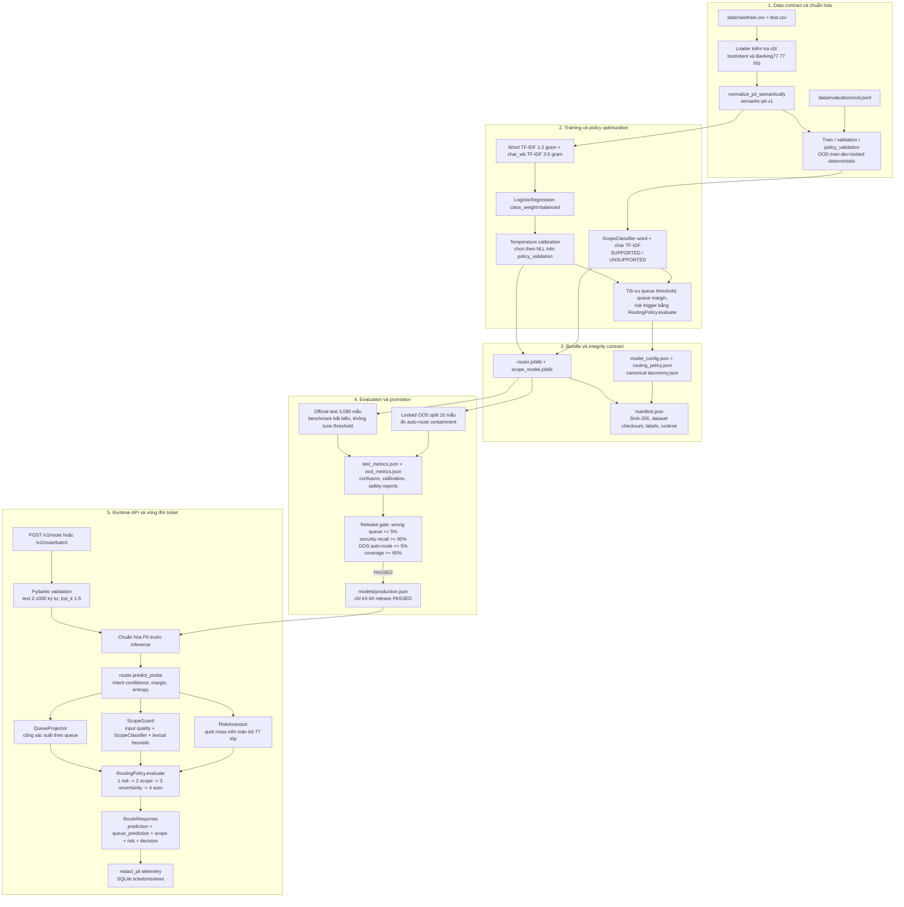

# Banking77 Support Router

[](https://www.python.org/)
[](https://fastapi.tiangolo.com/)
[](https://scikit-learn.org/)
[](https://pytest.org/)
[](https://www.docker.com/)
[](https://github.com/haminhthong/Banking77-Support-Router/actions/workflows/ci.yml)
[](LICENSE)

Hệ thống phân loại và phân luồng ticket hỗ trợ ngân hàng dựa trên Banking77. Model chỉ tạo xác suất cho 77 intent; quyết định vận hành được tách riêng thành queue, scope, risk và policy để hệ thống có thể tự động xử lý các ticket đủ an toàn, đồng thời chuyển các trường hợp bất định hoặc nhạy cảm cho người kiểm duyệt.

## Bài Toán & Phạm Vi Ứng Dụng (Problem & Scope)

### Bài toán

Một ticket ngân hàng cần đồng thời trả lời bốn câu hỏi:

1. Khách hàng đang hỏi về intent nào trong taxonomy Banking77?
2. Intent đó thuộc domain và queue vận hành nào?
3. Ticket có tín hiệu gian lận, bảo mật hoặc sai lệch tiền cần ưu tiên không?
4. Hệ thống có đủ chắc chắn và ticket có nằm trong phạm vi hỗ trợ để tự động route không?

Nếu chỉ lấy `argmax` của classifier làm quyết định cuối, hệ thống có thể tự động route một câu hỏi ngoài phạm vi, bỏ sót tín hiệu bảo mật nằm ở lớp xác suất thấp, hoặc dùng nhãn `priority` của taxonomy như một kết luận gian lận. Dự án giải quyết các rủi ro đó bằng một pipeline có policy duy nhất chi phối runtime, training, evaluation và release gate.

### Trong phạm vi

- Phân loại đủ 77 intent Banking77.
- Chuẩn hóa PII theo cùng một contract ở training và serving.
- Chiếu xác suất intent thành xác suất queue vận hành.
- Phát hiện input kém chất lượng và câu hỏi ngoài phạm vi bằng scope model kết hợp heuristic.
- Quét tín hiệu security/risk trên toàn bộ 77 lớp, không phụ thuộc `top_k` hiển thị.
- Tách `prediction`, `risk assessment` và `routing decision`.
- Chỉ `auto_route` khi queue confidence, queue margin, entropy và scope đều đạt policy.
- Ghi telemetry đã redact PII, lưu ticket/review vào SQLite và hỗ trợ phản hồi của reviewer.
- Kiểm tra checksum artifact, taxonomy, manifest và release gate trước khi cập nhật production pointer.

### Ngoài phạm vi

- Không thực hiện giao dịch, khóa thẻ, hoàn tiền hoặc thay đổi tài khoản.
- Không thay thế quyết định của chuyên viên trong các ca fraud/security.
- Không phải hệ thống tư vấn tài chính hay hệ thống xác minh danh tính.
- Chỉ hỗ trợ ngữ liệu và taxonomy của Banking77; câu hỏi ngoài domain phải đi qua `human_review`.
- Release gate hiện dùng locked OOS split 10 mẫu như một kiểm tra containment; đây không phải bộ đo lường toàn diện cho mọi ngôn ngữ hoặc mọi sản phẩm ngân hàng.

## Luồng logic, luồng data và pipeline kỹ thuật

Toàn bộ mã nguồn, cấu hình, artifact và báo cáo phải tuân theo một flow duy nhất dưới đây. Các nhánh `risk`, `scope` và `uncertainty` là các lớp bảo vệ độc lập; `top_k` chỉ kiểm soát số alternative hiển thị, không được dùng làm đầu vào cho safety engine.



### Quy tắc policy bắt buộc

`RoutingPolicy.evaluate` là điểm duy nhất quyết định action cuối cùng. Thứ tự không được đảo:

1. Nếu risk signal đủ mạnh và taxonomy đánh dấu `priority_escalation: true`, trả `priority_human_review` tới `fraud_security_queue` hoặc escalation queue tương ứng.
2. Nếu input ngoài scope hoặc kém chất lượng, trả `human_review` tới `general_human_review_queue`.
3. Nếu queue confidence, queue margin hoặc entropy không đạt, trả `human_review`.
4. Chỉ khi ba lớp trên đều an toàn mới trả `auto_route` tới queue dự đoán.

`priority: critical` trong taxonomy là mức ưu tiên vận hành. Nó không tự động có nghĩa là fraud/security. Security escalation chỉ được phép phát sinh từ metadata `risk.priority_escalation: true`. Ví dụ `wrong_amount_of_cash_received` có thể là sự cố tiền mặt cần điều tra nhưng không tự động bị xếp vào fraud queue.

Risk được tính trên tổng xác suất của từng nhóm rủi ro và luôn quét toàn bộ vector 77 lớp. Vì vậy, `top_k=1` và `top_k=5` chỉ làm thay đổi danh sách alternative trả về cho client; không làm thay đổi đánh giá risk hay quyết định an toàn.

## Cấu trúc thư mục dự án

```text
Banking77-Support-Router/
├── .github/workflows/ci.yml       # CI: install, compile và pytest
├── configs/
│   ├── model.yaml                 # feature, classifier và calibration
│   ├── routing_policy.yaml        # threshold, OOD, risk và release SLO
│   └── taxonomy.yaml              # 77 intent, domain, queue, priority, risk
├── data/
│   ├── raw/                       # train.csv, test.csv; tải bằng script
│   └── evaluation/ood.jsonl       # mẫu ngoài phạm vi, split deterministic
├── models/
│   ├── production.json            # production pointer duy nhất
│   └── releases/
│       ├── banking-router-v4/     # rollback artifact
│       └── banking-router-v5/     # release đang PROMOTED
├── reports/
│   ├── v5-training/               # validation khi train candidate
│   └── v5-evaluation/            # test, OOD, safety và calibration report
├── scripts/
│   ├── download_data.py           # tải và kiểm checksum dataset
│   ├── prepare_ci.py              # chuẩn bị dataset/model cho checkout sạch
│   ├── promote_release.py         # evaluate gate rồi mới promote
│   └── manual_api_test.py         # smoke test thủ công
├── src/
│   ├── banking_router/            # package canonical
│   │   ├── api/                   # FastAPI app và Pydantic schemas
│   │   ├── data/                  # loader, normalization, audit, split
│   │   ├── evaluation/            # benchmark, calibration, safety, OOD
│   │   ├── modeling/              # training, artifact, scope, release
│   │   ├── routing/               # taxonomy, queue, risk, policy, service
│   │   ├── storage/               # SQLite tickets và reviews
│   │   └── telemetry/             # event và privacy redaction
│   ├── train.py                   # CLI facade huấn luyện candidate
│   ├── evaluate.py                # CLI facade đánh giá candidate
│   ├── api.py                     # facade legacy tương thích ngược
│   ├── data.py                    # facade legacy
│   └── policy.py                  # facade legacy
├── tests/
│   ├── unit/                      # invariant policy, taxonomy, normalization
│   ├── integration/               # service và API
│   └── test_smoke.py              # smoke test tương thích ngược
├── Dockerfile
├── Makefile
├── pytest.ini
├── requirements.txt
└── README.md
```

Package canonical là `src.banking_router`. Các module ở trực tiếp dưới `src/` chỉ giữ tương thích ngược cho client/test cũ; entrypoint mới phải dùng `src.banking_router.api.app:app`.

## Cài đặt

Yêu cầu Python 3.11 trở lên. Từ thư mục gốc repository:

```powershell
python -m venv .venv
.venv\Scripts\Activate.ps1
python -m pip install --upgrade pip
python -m pip install -r requirements.txt
```

Tải dữ liệu Banking77 và xác minh SHA-256 trước khi ghi vào `data/raw/`:

```powershell
python scripts/download_data.py
```

Nếu repository đã có dataset đúng checksum thì có thể bỏ qua bước tải. Không sửa tay CSV sau bước này vì checksum được ghi vào model manifest khi train.

## Huấn luyện, đánh giá và promote release

Quy trình candidate không ghi đè production pointer:

```powershell
# 1. Train candidate vào models/releases/banking-router-v6
python -m src.train

# 2. Đánh giá candidate trên official test và locked OOS
python -m src.evaluate

# 3. Chỉ promote nếu mọi release SLO đều đạt
python scripts/promote_release.py `
  --release banking-router-v6 `
  --reports reports/v6-evaluation `
  --models models
```

CLI mặc định dùng:

| Lệnh | Model directory | Report directory |
|---|---|---|
| `python -m src.train` | `models/releases/banking-router-v6` | `reports/v6-training` |
| `python -m src.evaluate` | `models/releases/banking-router-v6` | `reports/v6-evaluation` |

Có thể thay đổi đường dẫn:

```powershell
python -m src.train --models-dir models/releases/my-candidate --reports-dir reports/my-candidate-training
python -m src.evaluate --models-dir models/releases/my-candidate --reports-dir reports/my-candidate-evaluation
```

`promote_release.py` đọc `test_metrics.json` và `ood_metrics.json`, ghi `release_gate.json`, sau đó chỉ cập nhật `models/production.json` nếu đạt:

- `auto_route_wrong_queue_rate <= 0.05`;
- `high_risk_escalation_recall >= 0.95`;
- `oos_auto_route_rate <= 0.05`;
- `operational_auto_route_coverage >= 0.65`.

Ứng dụng khi chạy production giải quyết `models/production.json`, kiểm tra release gate và xác minh SHA-256 trước khi load. Release bị `REJECTED`, thiếu gate hoặc sai checksum sẽ bị fail-closed.

## Chạy API

Chạy entrypoint canonical:

```powershell
uvicorn src.banking_router.api.app:app --host 0.0.0.0 --port 8000
```

Hoặc dùng Makefile:

```powershell
make setup
make download
make train
make evaluate
make serve
make test
```

Docker:

```powershell
docker build -t banking77-support-router .
docker run --rm -p 8000:8000 banking77-support-router
```

Image sử dụng release artifact đã có trong `models/`. Dataset, tests và reports đầu vào bị loại khỏi build context qua `.dockerignore`; vì vậy cần train/promote trước khi build image. Healthcheck gọi `/health/ready` và chỉ thành công khi bundle, taxonomy, checksum và release gate hợp lệ.

## API contract

### Health

- `GET /health/live`: process còn sống.
- `GET /health/ready`: model, class count, release gate và production artifact đã sẵn sàng.
- `GET /health`: endpoint cũ, giữ để tương thích client legacy.

### Route một ticket

`POST /v1/route`

```json
{
  "text": "My card was stolen",
  "top_k": 3,
  "request_id": "optional-client-id"
}
```

Response canonical gồm:

- `prediction`: intent, domain, confidence, margin, entropy và alternatives;
- `queue_prediction`: queue và xác suất queue sau khi cộng xác suất intent;
- `scope`: ticket có được coi là supported hay không;
- `risk`: risk tier, high-risk intent, risk category, group mass và OOD flag;
- `decision`: `auto_route`, `human_review` hoặc `priority_human_review`, kèm queue, priority và reason codes;
- `versions`: model, policy và scope model đang phục vụ.

Ví dụ gọi API:

```powershell
curl -X POST http://127.0.0.1:8000/v1/route `
  -H "Content-Type: application/json" `
  -d '{"text":"My card was stolen","top_k":3}'
```

### Route batch

`POST /v1/route/batch` nhận 1-100 ticket. Inference model được vector hóa theo batch; mỗi ticket vẫn giữ `top_k` riêng cho phần alternatives. Safety decision của từng ticket được đánh giá độc lập và response có `decision_counts`.

### Feedback và review

- `POST /v1/feedback`: ghi phản hồi tương thích ngược hoặc review cho ticket đã lưu.
- `POST /v1/tickets/{request_id}/review`: ghi kết quả cuối của reviewer, cập nhật trạng thái ticket thành `REVIEWED`.

Nội dung ticket và notes được redact trước khi ghi telemetry/SQLite; dữ liệu persistence dùng cho audit và vòng lặp cải thiện, không tự động thay đổi production model.

## Release hiện tại và kết quả kiểm thử

Production pointer hiện trỏ tới `releases/banking-router-v5`, đã qua release gate. Các số liệu dưới đây là artifact đã commit trong repository:

| Chỉ số | Giá trị |
|---|---:|
| Official test accuracy | 0.9016 |
| Official test macro-F1 | 0.9019 |
| Official test top-3 accuracy | 0.9705 |
| Test ECE | 0.0140 |
| Operational auto-route coverage | 0.6981 |
| Auto-route wrong-queue rate | 0.0051 |
| High-risk escalation recall | 0.9821 |
| High-risk escalation precision | 0.8514 |
| Locked OOS auto-route rate | 0.0000 |
| Locked OOS containment | 1.0000 |

Artifact nguồn:

- [test_metrics.json](reports/v5-evaluation/test_metrics.json)
- [ood_metrics.json](reports/v5-evaluation/ood_metrics.json)
- [release_gate.json](models/releases/banking-router-v5/release_gate.json)
- [production.json](models/production.json)

## Kiểm thử và kiểm tra logic

Chạy toàn bộ test:

```powershell
python -m pytest -q
```

Các invariant quan trọng cần giữ:

- normalization giống nhau giữa train và serve;
- model luôn có đúng 77 class Banking77;
- taxonomy và model label set phải khớp;
- `top_k` không ảnh hưởng risk/policy;
- risk quét toàn bộ vector xác suất;
- OOS không được `auto_route`;
- weak OOS signal không tự động đẩy ticket vào fraud queue;
- release gate fail thì production pointer không đổi;
- checksum sai hoặc artifact thiếu thì readiness fail.

Nếu cần smoke test thủ công sau khi bật API:

```powershell
python scripts/manual_api_test.py
```

## CI

Workflow `.github/workflows/ci.yml` chạy trên GitHub Actions cho `push` vào `main`/`master`, pull request và chạy thủ công. Pipeline cố định Python 3.11, cài từ `requirements.txt`, chạy `scripts/prepare_ci.py` để tải dataset nếu checkout sạch chưa có CSV và kiểm tra release được production pointer sử dụng; nếu release không có thì train một candidate CI và tạo production pointer tạm thời. Sau đó CI compile `src`, `scripts`, `tests` và chạy toàn bộ pytest với `PYTEST_DISABLE_PLUGIN_AUTOLOAD=1` để kết quả không bị ảnh hưởng bởi plugin ngoài dependency của dự án.

## Làm sạch và nguyên tắc đóng góp

- Không commit `__pycache__`, `.pytest_cache`, `.pytest_tmp`, virtual environment, dataset tải về hoặc runtime telemetry.
- Không chỉnh trực tiếp release đang được production pointer sử dụng; tạo candidate release mới, evaluate và promote qua gate.
- Mọi thay đổi taxonomy, policy hoặc normalization phải đi kèm training/evaluation artifact tương ứng.
- README phải cập nhật cùng code khi thay đổi entrypoint, cấu hình, output report hoặc contract API.

## License

Dự án phát hành theo [MIT License](LICENSE).
