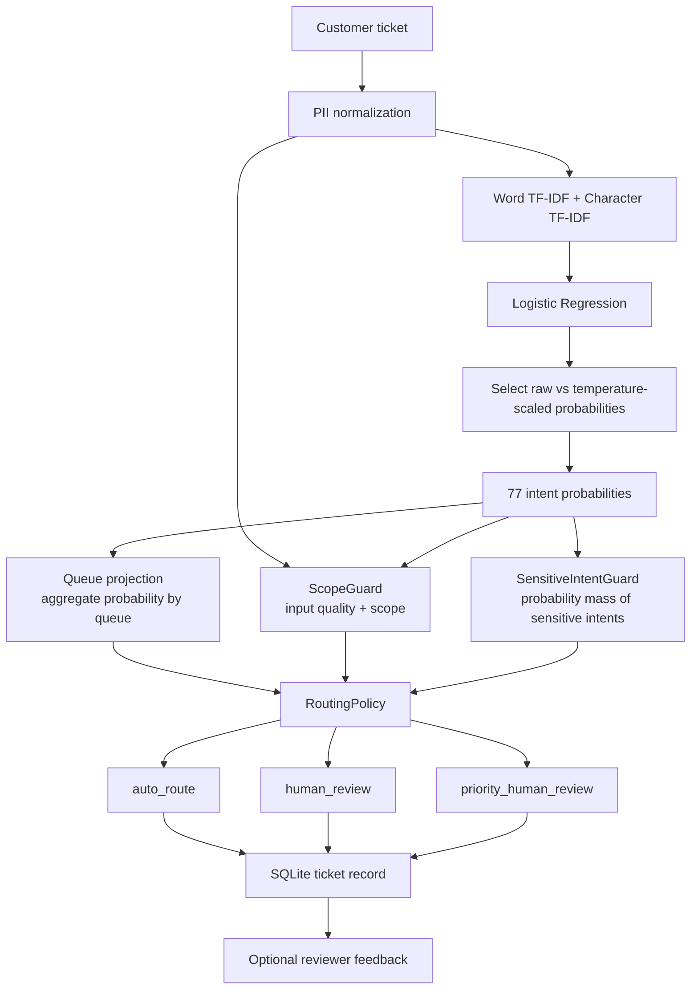

# Banking77 Support Router

[](https://github.com/haminhthong/Banking77-Support-Router/actions/workflows/ci.yml)
[](https://www.python.org/)
[](https://scikit-learn.org/)
[](https://fastapi.tiangolo.com/)
[](https://www.docker.com/)

Intent classification và uncertainty-aware support-ticket routing trên Banking77.

Model không tự quyết định queue bằng một nhãn top-1. Model tạo phân phối xác suất trên 77 intent; lớp routing tổng hợp xác suất theo queue, kiểm tra scope, kiểm tra tín hiệu intent nhạy cảm và chỉ `AUTO_ROUTE` khi đủ chắc chắn. Ticket mơ hồ, ngoài phạm vi hoặc cần ưu tiên review sẽ đi tới `HUMAN_REVIEW`.

## Bài toán & phạm vi ứng dụng

Support team nhận các ticket như “Where is my card?”, “Why was my cash withdrawal declined?” hoặc “I lost my phone”. Bài toán gồm hai phần:

1. Phân loại ticket vào một trong 77 intent chuẩn của Banking77.
2. Chuyển intent probabilities thành quyết định vận hành ở mức queue.

Phạm vi của prototype là phân luồng ticket hỗ trợ ngân hàng. Dự án không kết luận fraud, không thay thế nhân viên review, không tự retrain từ feedback và không phải SLA của ngân hàng. Nhãn nhạy cảm chỉ là tín hiệu để ưu tiên người kiểm tra.

## Luồng logic, luồng dữ liệu và pipeline kỹ thuật

Toàn bộ training, evaluation, API và test cùng bám vào pipeline sau:



### Thứ tự quyết định

`RoutingPolicy.evaluate()` là policy duy nhất và dùng cùng một thứ tự ở train, evaluate và API:

1. Có đủ tín hiệu intent nhạy cảm? → `priority_human_review` tới queue review.
2. Ticket ngoài scope hoặc input quá kém? → `human_review`.
3. Queue probability, queue margin, intent margin hoặc entropy chưa đạt threshold? → `human_review`.
4. Các điều kiện đều đạt? → `auto_route` tới queue được chọn.

Trong code, ba action cuối là các giá trị riêng: `auto_route`, `human_review` và `priority_human_review`. Hai action review đều được lưu cùng ticket vào SQLite; feedback reviewer là bước tùy chọn sau đó.

### Queue projection

Classifier có thể phân phối xác suất như sau:

```text
pending_transfer       0.32
receiving_money        0.28
transfer_timing        0.20
card_arrival           0.20
```

Ba intent đầu thuộc `transfers_queue`, vì vậy queue probability là `0.80` dù top-1 intent chỉ có `0.32`. Đây là lý do quyết định cuối không lấy trực tiếp `argmax(intent)`.

### Sensitive-case guard

`SensitiveIntentGuard` quét toàn bộ 77 probabilities thay vì chỉ nhìn top-1 hoặc top-k hiển thị. Ví dụ `compromised_card = 0.19` và `lost_or_stolen_card = 0.18` tạo sensitive probability mass `0.37`; policy có thể ưu tiên review dù top-1 là intent thông thường. Guard không tuyên bố gian lận; output của nó là `requires_priority_review`.

### Scope và giới hạn OOD

`ScopeGuard` kết hợp kiểm tra độ dài, token, gibberish, vocabulary overlap, classifier scope tùy chọn và confidence. Tập `data/evaluation/ood.jsonl` hiện là smoke/sanity set nhỏ 10 mẫu được curate thủ công. Kết quả `10/10 contained` chỉ mô tả hành vi trên tập này, không phải robust OOD benchmark hay safety guarantee.

### Calibration và selective classification

Pipeline so sánh xác suất raw với temperature-scaled probabilities trên policy-validation split và chọn temperature scaling khi NLL tốt hơn; nếu không, giữ raw probability. Evaluation giữ ECE, log loss, Brier score và risk–coverage curve.

Ý nghĩa selective routing:

- Tất cả ticket: ưu tiên độ chính xác tổng thể của classifier.
- Chỉ ticket đủ chắc chắn: cho phép auto-route với accuracy cao hơn.
- Ticket còn lại: giữ lại cho human review.

Threshold cao làm coverage giảm nhưng routing error giảm; đây là trade-off automation–reliability chính của dự án.

## Kết quả đánh giá tham chiếu

Các số dưới đây là kết quả trên test Banking77 chính thức 3.080 mẫu của bộ artifact hiện tại:

| Nhóm | Metric | Kết quả |
|---|---|---:|
| Intent classification | Accuracy | 90.16% |
| Intent classification | Macro-F1 | 90.19% |
| Intent classification | Top-3 accuracy | 97.05% |
| Calibration | ECE | 0.014 |
| Calibration | Log loss | 0.359 |
| Selective routing | Accepted coverage | 70.88% |
| Selective routing | Accepted accuracy | 98.95% |
| Selective routing | Selective risk | 1.05% |
| Queue routing | Auto-route coverage | 74.09% |
| Queue routing | Auto-route accuracy | 99.47% |
| Sensitive cases | Review recall | 95.00% |
| Scope smoke set | Contained | 10/10 |

Kết quả route hiện tại là 2.282/3.080 auto-route (74.09%), 501 human review và 297 priority review. Sensitive-case recall là 266/280 (95.00%); smoke set ngoài scope có 0/10 auto-route nên containment là 10/10. Thresholds trong `configs/routing_policy.yaml` là mục tiêu thực nghiệm để chọn trade-off trên validation split, không phải cam kết vận hành thực tế.

## Cấu trúc thư mục

```text
Banking77-Support-Router/
├── artifacts/
│   ├── intent_model.joblib
│   ├── scope_model.joblib
│   ├── metadata.json
│   ├── taxonomy.json
│   └── routing_policy.json
├── configs/
│   ├── model.yaml
│   ├── routing_policy.yaml
│   └── taxonomy.yaml
├── data/
│   ├── raw/                         # train.csv, test.csv; tải khi cần
│   └── evaluation/ood.jsonl         # smoke set ngoài scope
├── reports/                         # tạo khi train/evaluate/API chạy
├── scripts/
│   ├── __init__.py
│   ├── download_data.py
│   ├── prepare_ci.py
│   └── manual_api_test.py
├── src/
│   ├── train.py                     # CLI train
│   ├── evaluate.py                  # CLI evaluate
│   └── banking_router/
│       ├── api/                     # FastAPI schemas và endpoints
│       ├── data/                    # loader, split, normalization, audit
│       ├── evaluation/              # metric dùng chung, classification, calibration, selective, scope
│       ├── modeling/                # pipeline, calibration, training, artifact
│       ├── routing/                 # taxonomy, queue, scope, sensitive, policy, service
│       ├── storage/                 # SQLite ticket/review repository nhỏ
│       └── telemetry/               # hàm che PII dùng cho log/SQLite
├── tests/
├── Dockerfile
├── Makefile
├── requirements.txt
├── requirements-dev.txt
└── README.md
```

`artifacts/` là source of truth duy nhất cho inference. Không còn `models/releases`, `production.json`, release promotion, manifest/checksum bundle hoặc các bản config/model trùng lặp.

`configs/routing_policy.yaml` chỉ chứa mục tiêu thực nghiệm và các kiểm tra cố định dùng khi train. Threshold đã tối ưu cho serving được ghi vào một file duy nhất là `artifacts/routing_policy.json`; API, evaluator và test đều đọc từ artifact này. Seed tái lập được khai báo duy nhất là `SEED = 42` trong `src/banking_router/config.py`.

## Cài đặt

Yêu cầu Python 3.11 và Git.

```bash
git clone https://github.com/haminhthong/Banking77-Support-Router.git
cd Banking77-Support-Router
python -m venv .venv
```

Windows PowerShell (đủ dependency cho train, evaluate, test và lint):

```powershell
.\.venv\Scripts\Activate.ps1
python -m pip install -r requirements-dev.txt
```

Linux/macOS:

```bash
source .venv/bin/activate
python -m pip install -r requirements-dev.txt
```

`requirements.txt` chỉ chứa dependency runtime để Docker/API không kéo theo pandas, pytest hoặc Ruff. `scikit-learn` được khóa ở `1.7.1` để khớp với các artifact joblib đã train và tránh cảnh báo tương thích khi load model. `requirements-dev.txt` kế thừa runtime và thêm tool tải dữ liệu, train/evaluate, test và lint.

## Huấn luyện và đánh giá

Nếu `data/raw/train.csv` và `data/raw/test.csv` chưa có:

```bash
python -m scripts.download_data
```

Train ghi đè bộ artifact canonical trong `artifacts/` và report vào `reports/training/`:

```bash
python -m src.train
```

Evaluate đọc đúng bộ artifact đó và ghi report vào `reports/evaluation/`:

```bash
python -m src.evaluate
```

Có thể dùng Makefile:

```bash
make download
make train
make evaluate
make test
make lint
```

## Chạy API

```bash
uvicorn src.banking_router.api.app:app --host 0.0.0.0 --port 8000
```

Các endpoint chính:

- `GET /health/live`: process còn sống.
- `GET /health/ready`: model canonical đã load và có đủ 77 class.
- `POST /v1/route`: route một ticket.
- `POST /v1/route/batch`: route nhiều ticket.
- `POST /v1/feedback`: lưu kết quả review của một ticket đã tồn tại; ticket không tồn tại trả `404`.
- `POST /v1/tickets/{request_id}/review`: cập nhật review cho ticket đã lưu.

Contract request chính:

- `RouteRequest.text`: bắt buộc, dài từ 2 đến 1.000 ký tự.
- `RouteRequest.top_k`: từ 1 đến 5, mặc định `3`.
- `BatchRouteRequest.tickets`: từ 1 đến 100 ticket.
- `request_id`: tùy chọn; nếu bỏ trống service tự tạo mã dạng `req_<12 ký tự>`.

Ví dụ:

```bash
curl -X POST http://localhost:8000/v1/route \
  -H "Content-Type: application/json" \
  -d '{"text":"Why was my cash withdrawal declined?","top_k":3}'
```

Response tách rõ bốn lớp: `prediction`, `queue_prediction`, `scope`, `sensitive_case` và `decision`. Ticket và ghi chú review được che PII trước khi ghi SQLite; không có JSONL telemetry runtime.

## Docker

Artifact canonical đã nằm trong repository nên image chỉ cài dependency runtime, copy `src/` và `artifacts/`, kiểm tra model ngay lúc build, tạo `/app/reports` có quyền ghi và chạy bằng user không đặc quyền:

```bash
docker build -t banking77-support-router .
docker volume create banking77-reports
docker run --rm --name banking77-support-router \
  -p 8000:8000 \
  -v banking77-reports:/app/reports \
  banking77-support-router
```

Volume là tùy chọn nhưng nên dùng nếu muốn giữ SQLite review sau khi container bị xóa. Nếu không mount volume, `/app/reports` chỉ tồn tại trong vòng đời container. Healthcheck của image gọi `/health/ready`. Container smoke test trong CI tiếp tục POST một ticket thật tới `/v1/route` sau khi readiness thành công.

## CI và kiểm thử

GitHub Actions có hai job. Job `quality` dùng Python 3.11, cài `requirements-dev.txt`, chạy `python -m scripts.prepare_ci`, `pip check`, Ruff lint/format, compile và pytest. Job `docker-smoke` chỉ chạy sau quality, build Docker image, chờ `/health/ready`, rồi POST `/v1/route`. Bước prepare chỉ tải dataset nếu checkout thiếu CSV và load artifact canonical để fail sớm khi thiếu model; nó không tạo release pointer hay promotion state.

Chạy local:

```bash
python -m scripts.prepare_ci
python -m compileall -q src scripts tests
python -m pytest -q
python -m ruff check src scripts tests
python -m ruff format --check src scripts tests
```

Kiểm thử thủ công bằng FastAPI `TestClient` (không cần khởi động server riêng):

```bash
python -m scripts.manual_api_test
```

## Giới hạn và hướng mở rộng

- Banking77 là dữ liệu intent support, không phải fraud dataset.
- OOD hiện chỉ là 10 mẫu smoke/sanity; muốn claim mạnh hơn cần tập đánh giá 100–300 mẫu đa dạng.
- Feedback SQLite chỉ lưu outcome review để phân tích sau, chưa tự động retrain.
- Threshold nên được điều chỉnh khi có dữ liệu nghiệp vụ thật và mục tiêu coverage/reliability được xác định rõ.
